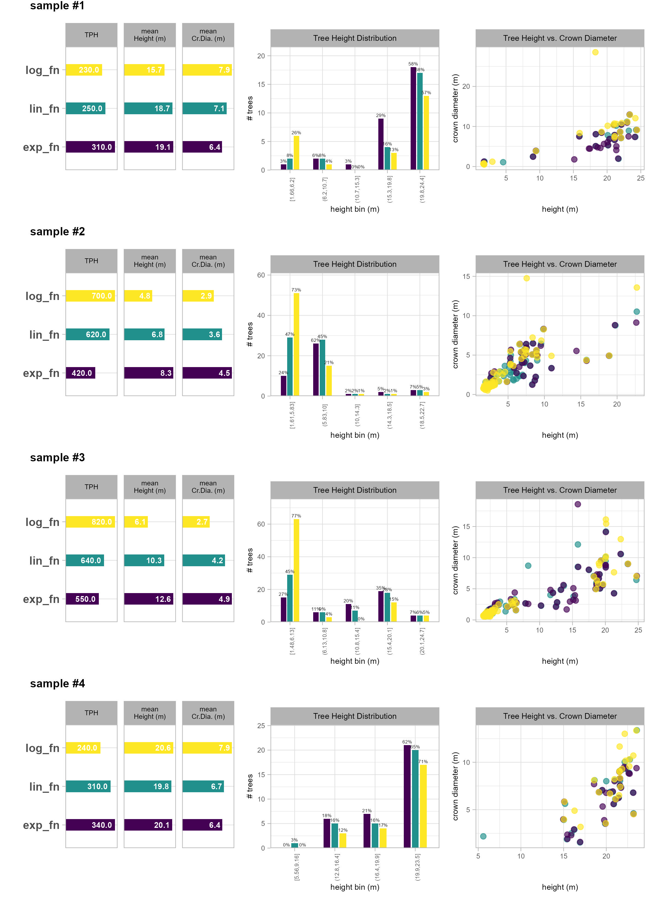
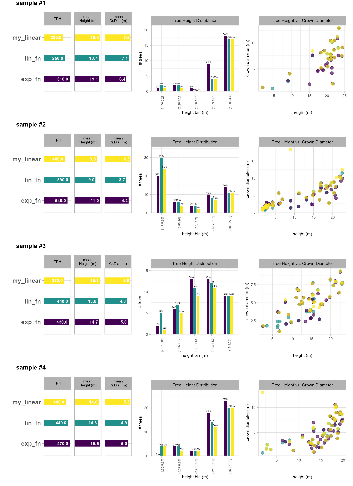
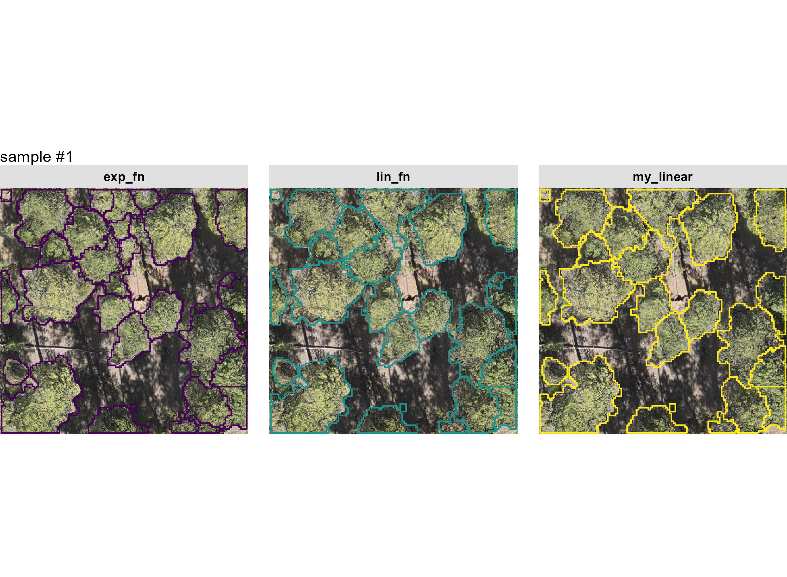
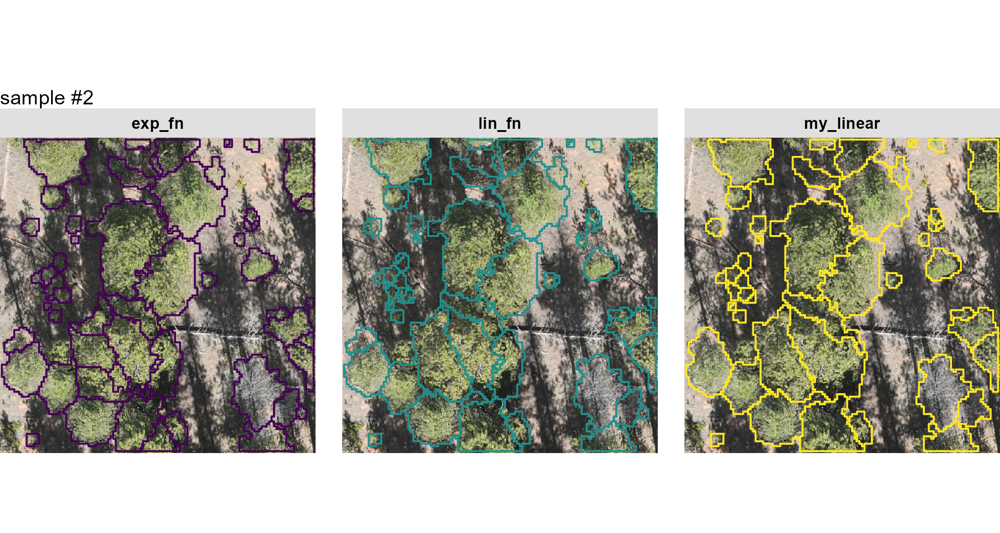
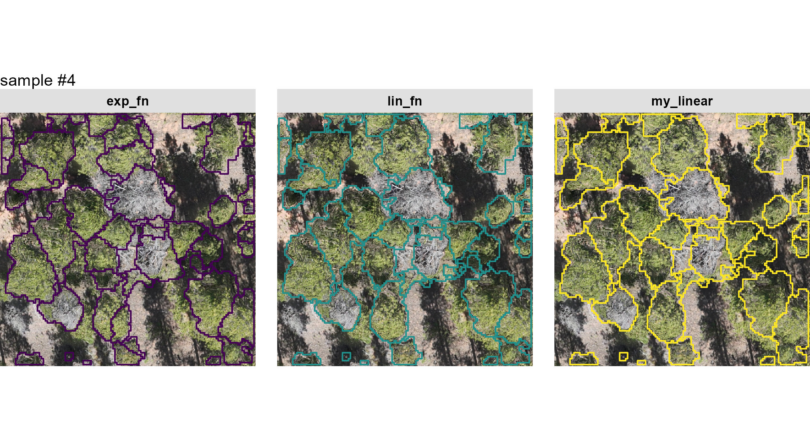

The 2002 Hayman Fire ([Graham 2003](https://doi.org/10.2737/RMRS-GTR-114); [Moriarty & Cheng, 2012](https://scholar.google.com/scholar?cluster=7513861891704405356&hl=en&as_sdt=0,6)) was the largest in Colorado history at the time and it severely impacted the Cheesman Reservoir and watershed. The reservoir, along with ~8,000 ac surrounding, is managed by Denver Water and is adjacent to the Pike San Isabel National Forest. The high severity fire resulted in near total mortality of the ponderosa pine and Douglas-fir forest surrounding the reservoir which necessitated active planting of seedlings through partnerships between Denver Water and the US Forest Service, Colorado State Forest Service, National Resource Conservation Service and the Colorado Forest Restoration Institute through the *From Forests to Faucets* program ([Denver Water](https://storymaps.arcgis.com/stories/6ef2af96207046baa8451cf20def46cb)). 

The objective of this project is to demonstrate the use of UAS remote sensing to evaluate the survival and growth of the reforestation efforts surrounding the Cheesman Reservoir. An exploratory site visit was made on April 03, 2026 by representatives from Denver Water (Jessica Jackman), CSFS (Ethan Bucholz, Andy Whelan, and Spencer Weston), CFRI (Caden Chamberlain), and CSU (George Woolsey). A single, preliminary UAS flight was completed with the DJI Mavic xx over one of the sites that had some of the first plantings. The flight took ~10 minutes with flight settings programmed to capture data for SfM processing to generate aerial point cloud data and a spectral orthomosaic.

```{r, include=FALSE, warning=F, message=F}
################################################
##```{r,eval=T
################################################
# clean session
remove(list = ls())
gc()
# knit options
knitr::opts_chunk$set(
  echo = TRUE
  , warning = FALSE
  , message = FALSE
  # , results = 'hide'
  , fig.width = 10.5
  , fig.height = 7
)
# option to put satellite imagery as base layer of mapview maps
  mapview::mapviewOptions(
    homebutton = FALSE
    # , basemaps = c("Esri.WorldImagery","OpenStreetMap")
    , basemaps = c("OpenStreetMap", "Esri.WorldImagery")
  )
```

# Preliminary Data

let's check out the preliminary data captured from a single UAS flight that was completed on April 03, 2026 with the DJI Mavic xx over one of the sites that had some of the first plantings. The flight took ~10 minutes with flight settings programmed to capture data for SfM processing to generate aerial point cloud data and a spectral orthomosaic.

load the standard libraries we use to do work 

```{r}
# bread-and-butter
library(tidyverse) # the tidyverse
library(viridis) # viridis colors
library(harrypotter) # hp colors
library(RColorBrewer) # brewer colors
library(scales) # work with number and plot scales
library(latex2exp)

# visualization
library(mapview) # interactive html maps
library(kableExtra) # tables
library(patchwork) # combine plots
library(ggnewscale) # new scale
library(ggrepel) # repel labels

# spatial analysis
library(terra) # raster
library(sf) # simple features
library(lidR) # lidR
library(cloud2trees) # cloud2trees
```

```{r, warning=FALSE, message=FALSE, echo=FALSE, include=FALSE}
remove(list = ls()[grep("_temp",ls())])
gc()
```

Though not necessary for `cloud2trees` data processing, let's quickly check out the location and structure of the data we have

```{r,eval=T,purl=FALSE}
# directory with the downloaded .las|.laz files
point_cld_folder <- "../data/CheesmanLAS/"
# is there data?
list.files(point_cld_folder, pattern = ".*\\.(laz|las)$") %>% length()
# what files are in here?
list.files(point_cld_folder, pattern = ".*\\.(laz|las)$")[1]
```

again, this is not necessary for `cloud2trees` data processing but we can use `lidR` to read the point cloud folder as a catalog which doesn't read in the actual points but just the point cloud header data which includes information on things like the spatial location of the data, the point density, and other point attributes

```{r,eval=T,purl=FALSE}
# read folder as LAScatalog
ctg_temp <- lidR::readLAScatalog(point_cld_folder)
# what information do we get about the point cloud?
ctg_temp
```

let's look at the point cloud extent on a map to orient ourselves in space

```{r,eval=T,purl=FALSE}
ctg_temp %>% 
  cloud2trees:::check_las_ctg_empty() %>% 
  purrr::pluck("data") %>% 
  mapview::mapview(popup = F, layer.name = "point cloud tile")
```

i told you that we didn't need to do any of that for `cloud2trees` data processing and to prove it, we'll remove the `ctg_temp` object from our session

```{r, warning=FALSE, message=FALSE}
remove(list = ls()[grep("_temp",ls())])
gc()
```

we also got an orthomosaic of at least RGB spectral bands. we might also have gotten 4-band imagery if the Mavic xx used for the flight included a sensor that also captures the NIR band?

```{r}
#### pc extent vs rgb rast
rgb_rast_fnm <- "../data/CheesmanOrtho/result.tif"
rgb_rast <- terra::rast(rgb_rast_fnm)
```

what is this raster data?

```{r}
rgb_rast
```

it looks like there might actually be a forth band...

```{r}
terra::hist(rgb_rast)
```

...or not. that forth band is probably the alpha channel. let's check out the RGB

```{r}
rgb_rast <- rgb_rast %>% terra::subset(c(1:3))
# get them from the cloud2trees hidden package
# plot
terra::plotRGB(rgb_rast)
# terra::plot(
#   rgb_rast
#   , nc = 3
#   # , nr = 3
#   , mar = c(0.5,0.5,0.5,0.5)
#   , axes = FALSE
#   , legend = F
#   # , col = grDevices::gray.colors(n=111)
# )
```

looks pretty good and there are certainly shadows on the ground from trees (hopefully). let's zoom in on the 5000 square meter central area

```{r, fig.height=8, fig.width=8}
rgb_rast %>%
  terra::crop(
    terra::ext(rgb_rast[[1]]) %>% 
      sf::st_bbox() %>% 
      sf::st_as_sfc() %>% 
      sf::st_centroid() %>% 
      sf::st_buffer(sqrt(5000)/2) %>% 
      sf::st_bbox() %>% 
      sf::st_as_sfc() %>% 
      sf::st_set_crs(terra::crs(rgb_rast)) %>% 
      terra::vect()
    , mask = T
  ) %>% 
  terra::plotRGB()
```

green trees!

```{r, warning=FALSE, message=FALSE, echo=FALSE, include=FALSE}
remove(list = ls()[grep("_temp",ls())])
gc()
```

## Point Cloud to Raster: `cloud2raster()`

Although the `cloud2trees::cloud2trees()` function combines methods in the `cloud2trees` package for an all-in-one approach, we'll instead use the `cloud2trees::cloud2raster()` function to generate a CHM from the point cloud that we can work with to perform both individual tree detection and slash pile identification (discussed later).

We'll set the options in the function to generate a CHM which represents a DSM with the ground removed and no other filtering. This high resolution (i.e. fine-grain) CHM will serve as the foundation for tree detection and slash pile detection as we can manipulate it to optimize the processing for both methods.

```{r}
# outdir
c2t_output_dir <- "../data"
c2t_process_dir <- file.path(c2t_output_dir, "point_cloud_processing_delivery")
c2t_tracking_fnm <- file.path(c2t_process_dir, "processed_tracking_data.csv")
##############################################################
# cloud2trees::cloud2raster
##############################################################
if(
  !file.exists( file.path(c2t_process_dir, "chm_0.1m.tif") )
  || !file.exists( file.path(c2t_process_dir, "dtm_0.25m.tif") )
){
  # time it
  st_temp <- Sys.time()
  # run it
  # cloud2trees
  cloud2raster_ans <- cloud2trees::cloud2raster(
    output_dir = c2t_output_dir
    , input_las_dir = point_cld_folder
    , accuracy_level = 2
    , keep_intrmdt = T
    , dtm_res_m = 0.25
    , chm_res_m = 0.1
    , min_height = 0 # effectively generates a DSM based on non-ground points
  )
  
  # timer
  mins_temp <- difftime(Sys.time(),st_temp,units = "mins") %>% as.numeric()
  # save tracking
  dplyr::tibble(
    timer_cloud2raster_mins = mins_temp
  ) %>% 
    write.csv(
      file = c2t_tracking_fnm
      , row.names = F, append = F
    )
}else{
  dtm_temp <- terra::rast( file.path(c2t_process_dir, "dtm_0.25m.tif") )
  chm_temp <- terra::rast( file.path(c2t_process_dir, "chm_0.1m.tif") )
  
  cloud2raster_ans <- list(
    "dtm_rast" = dtm_temp
    , "chm_rast" = chm_temp
  )
}
```

```{r, warning=FALSE, message=FALSE, echo=FALSE, include=FALSE}
remove(list = ls()[grep("_temp",ls())])
remove(f)
gc()
```

let's see what we got from `cloud2trees::cloud2raster()`

```{r}
cloud2raster_ans %>% names()
```

there's a DTM

```{r}
# plot to check out the fine-resolution DTM raster
cloud2raster_ans$dtm_rast %>% 
  terra::plot(col = harrypotter::hp(n=100, option = "mischief"), main = "DTM (m)")
```

there's a CHM

```{r}
# plot to check out the fine-resolution CHM raster
cloud2raster_ans$chm_rast %>% 
  terra::plot(col = viridis::plasma(n=100), main = "CHM (m)")
```

let's see some details about the CHM

```{r}
# what chm?
cloud2raster_ans$chm_rast
# what data?
cloud2raster_ans$chm_rast %>% terra::summary()
```

for tree detection, we'll aggregate the CHM to a lower resolution (i.e. coarser) to smooth out some of the fine detail that can increase the noise in the tree detection processing. This aggregation process also will speed up the processing and reduce the chances of computational memory issues.

```{r}
##################################################################
# aggregate to make raster more coarse for tree detection
##################################################################
# first, we'll borrow from the `cloud2trees` codebase to get a function to change the resolution of a raster exactly
###___________________________________________###
# adjust the resolution of a raster to be in exactly the target resolution
###___________________________________________###
if(
  !file.exists( file.path(c2t_process_dir, "chm_0.20m.tif") )
){
  agg_chm_rast <- cloud2trees:::adjust_raster_resolution(
    cloud2raster_ans$chm_rast
    , target_resolution = 0.20
    , fun = max
    , resample_method = "max"
    , ofile = file.path(c2t_process_dir, "chm_0.20m.tif")
  )
}else{
  agg_chm_rast <- terra::rast( file.path(c2t_process_dir, "chm_0.20m.tif") )
}
# what chm?
agg_chm_rast
# what data?
agg_chm_rast %>% terra::summary()
```

let's go back to the central 5000 square meter area and look at the CHM over the RGB

first, we'll plot the 0.1 m resolution CHM overlaid

```{r, fig.height=8, fig.width=8}
# aoi_temp
aoi_temp <- terra::ext(rgb_rast[[1]]) %>% 
  sf::st_bbox() %>% 
  sf::st_as_sfc() %>% 
  sf::st_centroid() %>% 
  sf::st_buffer(sqrt(5000)/2) %>% 
  sf::st_bbox() %>% 
  sf::st_as_sfc() %>% 
  sf::st_set_crs(terra::crs(rgb_rast)) %>% 
  terra::vect()
rgb_rast %>%
  terra::crop(aoi_temp, mask = T) %>% 
  terra::plotRGB(
    mar = c(0.1,0.1,1.5,5)
    , main = "0.1 m resolution CHM"
  )
cloud2raster_ans$chm_rast %>%
  # agg_chm_rast %>% 
  terra::crop(aoi_temp, mask = T) %>% 
  terra::plot(
    add = T
    , axes = F
    , col = viridis::plasma(n=100) # harrypotter::hp(n=100, option = "gryffindor")
    , alpha = 0.4
    , plg = list(title = "CHM (m)", title.cex = 0.9, shrink = 0.6)
  )
```

now, we'll plot the 0.2 m resolution CHM overlaid

```{r, fig.height=8, fig.width=8}
rgb_rast %>%
  terra::crop(aoi_temp, mask = T) %>% 
  terra::plotRGB(
    mar = c(0.1,0.1,1.5,5)
    , main = "0.2 m resolution CHM"
  )
agg_chm_rast %>% 
  terra::crop(aoi_temp, mask = T) %>% 
  terra::plot(
    add = T
    , axes = F
    , col = viridis::plasma(n=100) # harrypotter::hp(n=100, option = "gryffindor")
    , alpha = 0.4
    , plg = list(title = "CHM (m)", title.cex = 0.9, shrink = 0.6)
  )
```

....interesting

```{r, warning=FALSE, message=FALSE, echo=FALSE, include=FALSE}
remove(list = ls()[grep("_temp",ls())])
gc()
```

## ITD Tuning

from the `cloud2trees` readme:

>The `itd_tuning()` function is used to visually assess tree crown delineation results from different window size functions used for the detection of individual trees. `itd_tuning()` allows users to test different window size functions on a sample of data to determine which function is most suitable for the area being analyzed. The preferred function can then be used in the `ws` parameter in `raster2trees()` and `cloud2trees()`.

let's take this `cloud2trees::itd_tuning()` function for a spin with the parameter settings `chm_res_m = 0.25` since we plan on processing the entire data extent using a 0.25 m CHM resolution, `n_samples = 4` to get four 0.1 ha sample areas on which to visually assess the window functions, and `min_height = 1.37` to require that any potential tree has a height of at least 1.37 m to be considered a "tree"

```{r, include=TRUE, eval=FALSE}
itd_tuning_ans <- 
  cloud2trees::itd_tuning(
    input_las_dir = "../data/N1_400AGL_20MPH_TFOFF/"
    , n_samples = 4
    , min_height = 1.37
    , chm_res_m = 0.25
  )
```

```{r, include=F, eval=T, echo=F}
itd_tuning_ans <- 
  cloud2trees::itd_tuning(
    input_las_dir = "../data/N1_400AGL_20MPH_TFOFF/"
    , n_samples = 1
    , min_height = 2
    , chm_res_m = 0.25
  )
```

what does `cloud2trees::itd_tuning()` give us?

```{r}
names(itd_tuning_ans)
```

it's a named list. let's check out the `plot_*` results

```{r, include=T, eval = FALSE}
itd_tuning_ans$plot_samples
# write the file to the disk for posterity
ggplot2::ggsave(filename = "../data/itd_tuning_plot_samples1.jpg", height = 11, width = 8, dpi = "print")
```

```{r, echo=FALSE, out.width="80%", out.height="80%", fig.align='center', fig.show='hold',results='asis'}
knitr::include_graphics("../data/itd_tuning_plot_samples1.jpg")
```

the most noticeable difference between the window functions is with the segmentation of tall areas of the CHM using the `log_fn` compared to the other two. this function appears to not be separating tall trees appropriately: it is under-segmenting these areas resulting in too few tall trees. this under-segmentation by the `log_fn` can be seen most clearly in the top-left tall tree group of sample 1 and the top-left tall tree group of sample 4

comparing the `lin_fn` (linear function) and `exp_fn` (exponential function) shows that both functions result in similar segmentation results for taller trees but the primary differences appear for shorter trees. The difference in short-tree segmentation between these two functions is most evident in sample 2 where the `lin_fn` predicts many more small trees than the `exp_fn`. This appears to be an over-segmentation (too many trees) by the `lin_fn` for shorter trees which is perhaps most clear in the area just above the very center of sample 2

let's check out the resulting tree distribution of the different window functions over these sample areas

```{r, include=T, eval = FALSE}
itd_tuning_ans$plot_sample_summary
# write the file to the disk for posterity
ggplot2::ggsave(filename = "../data/itd_tuning_plot_sample_summary1.jpg", height = 11, width = 8, dpi = "print")
```

```{r, echo=FALSE, out.width="80%", out.height="80%", fig.align='center', fig.show='hold',results='asis'}

```

these results confirm what we identified about the `log_fn` compared to the other two: that it under-segments taller trees. predicting too few tall trees by not separating multiple tree crowns has the effect of producing tall trees with very wide crowns. this result is shown by the outlier yellow points in the RHS plots where the crown is predicted to be wider than the tree is tall (unlikely for this forest type)

let's look at the default window function named `lin_fn` (i.e. linear function) from `cloud2trees` to see how we might adjust it to obtain different tree segmentation results

```{r}
itd_tuning_ans$ws_fn_list$lin_fn
```

it's a function defining the window size (called `y`) based on the CHM height (called `x`)

we can plot the two functions that we did not rule out based on the first set of `cloud2trees::itd_tuning()` samples

```{r}
# plot the ws fn
ggplot2::ggplot() +
  ggplot2::geom_function(fun = itd_tuning_ans$ws_fn_list$lin_fn, aes(color = "lin_fn"), lwd = 1) +
  ggplot2::geom_function(fun = itd_tuning_ans$ws_fn_list$exp_fn, aes(color = "exp_fn"), lwd = 1) +
  ggplot2::xlim(-5,42) +
  ggplot2::labs(x = "heights", y = "ws", color = "") +
  ggplot2::theme_light()
```

the `lin_fn` (linear function) and `exp_fn` (exponential function) result in similar window sizes for higher CHM values but the `exp_fn` expands the window size for shorter areas compared to the `lin_fn`. 

let's make a custom linear function that expands the search window for shorter trees but keeps roughly the same window size for taller trees. looking at the plot of the two functions, we want to make a new, piecewise linear function that passes through (3.5,1.5) which is a point between the `exp_fn` and `lin_fn` in the 2-7.5 x-range

```{r}
# define a custom function
my_linear <- function(x){
    y <- dplyr::case_when(
      is.na(x) ~ 0.001
      , x < 0 ~ 0.001
      , x < 1.5 ~ 1 # (1.5,1) is connection for the next piece
      # next piece:
        # we want it to pass through ~ (3.5,1.5)
        # m = (y2-y1)/(x2-x1) >> m = (1.5-1)/(3.5-1.5) = 0.25
        # b = y-(m*x) >> b = 1-(0.25*1.5) = 0.625
      , x < 7 ~ 0.625 + x*0.25 
      # upper limit starts at (35,5)
      , x > 35 ~ 5
      # next piece:
        # at x=7, first segment y = 0.625+7*0.25 = 2.375 >> (7,2.375)
        # connect to (35,5)
        # m = (5-2.375)/(35-7) = 0.09375
        # b = 2.375-(0.09375*7) = 1.71875
        # 7 <= x < 35
      , T ~ 1.71875 + x*0.09375
    )
    return(y)
}
```

let's visualize these functions we'll use for the second `cloud2trees::itd_tuning()` sampling

```{r}
ggplot2::ggplot() +
  ggplot2::geom_function(fun = itd_tuning_ans$ws_fn_list$lin_fn, aes(color = "lin_fn"), lwd = 1) +
  ggplot2::geom_function(fun = itd_tuning_ans$ws_fn_list$exp_fn, aes(color = "exp_fn"), lwd = 1) +
  ggplot2::geom_function(fun = my_linear, aes(color = "my_linear"), lwd = 1) +
  ggplot2::xlim(-5,42) +
  ggplot2::labs(x = "heights", y = "ws", color = "") +
  ggplot2::theme_light()
```

re-run tuning with new function

```{r, include=TRUE, eval=FALSE}
# let's put these in a list to test with the best default function we saved from above
my_fn_list <- list(
  lin_fn = cloud2trees::itd_ws_functions()[["lin_fn"]]
  , exp_fn = cloud2trees::itd_ws_functions()[["exp_fn"]]
  , my_linear = my_linear
)
itd_tuning_ans2 <- 
  cloud2trees::itd_tuning(
    input_las_dir = "../data/N1_400AGL_20MPH_TFOFF/"
    , ws_fn_list = my_fn_list
    , n_samples = 4
    , min_height = 1.37
    , chm_res_m = 0.25
  )
```

let's check out the `plot_*` results

```{r, include=T, eval = FALSE}
itd_tuning_ans2$plot_samples
# write the file to the disk for posterity
ggplot2::ggsave(filename = "../data/itd_tuning_plot_samples2.jpg", height = 11, width = 8, dpi = "print")
```

```{r, echo=FALSE, out.width="80%", out.height="80%", fig.align='center', fig.show='hold',results='asis'}
knitr::include_graphics("../data/itd_tuning_plot_samples2.jpg")
```

the `lin_fn` (linear function) and our custom `my_linear` function yield similar tree segmentation results for sample 1 which is what we expected since that area consists primarily of taller trees and the biggest change we made to `my_linear` function was to expand the search window for shorter trees so that less were detected compared to the default `lin_fn`. Compared to the `exp_fn` (exponential function), both linear functions identify fewer tall trees with the difference most noticeable in the top central portion of the plot of sample 1, just below the center point of sample 2, and the top center of sample 4. Our custom `my_linear` function yields fewer small trees than the default `lin_fn` since we allowed a window size at lower portions of the CHM with this effect most clear for the short trees (purple CHM regions) on samples 2 and 3. The small tree detection results between `my_linear` and `exp_fn` are similar. At this point, we are leaning toward our custom `my_linear` function since the `exp_fn` may be over-segmenting taller trees (i.e. splitting one tree into many trees improperly).

let's check out the resulting tree distribution of the different window functions over these sample areas

```{r, include=T, eval = FALSE}
itd_tuning_ans2$plot_sample_summary
# write the file to the disk for posterity
ggplot2::ggsave(filename = "../data/itd_tuning_plot_sample_summary2.jpg", height = 11, width = 8, dpi = "print")
# save the crowns too?
itd_tuning_ans2$crowns %>% sf::st_write(dsn = "../data/itd_tuning_crowns.gpkg", quiet = T, append = F) 
```

```{r, echo=FALSE, out.width="80%", out.height="80%", fig.align='center', fig.show='hold',results='asis'}

# this is after we've already run the itd_tuning_ans2
itd_tuning_ans2 <- list(crowns = NULL)
itd_tuning_ans2$crowns <- sf::st_read("../data/itd_tuning_crowns.gpkg", quiet = T)
```

the scatter plots of tree height and crown diameter show that there are some shorter or intermediate trees that our custom `my_linear` function predicts to have unrealistic broad crowns where the crown diameter is greater than the tree height (e.g. sample 2 and 4). This conflicts with our intuition based on the visual inspection of the crowns overlaid on the CHM. Are these trees at the edges of the sample area where we may be getting edge effects? are the other window functions tested predicting similar segments in these areas?

let's check out the crown polygon data we got from our second `itd_tuining()` iteration

```{r}
itd_tuning_ans2$crowns %>% dplyr::glimpse()
```

this data includes the crown polygons for each window function and 0.1 ha sample plot

```{r}
itd_tuning_ans2$crowns %>% 
  sf::st_drop_geometry() %>% 
  dplyr::count(sample_number,ws_fn)
```

let's investigate the suspicious segments where crown diameter is greater than the tree height but limit our search to only trees > 2m in height since it is believable that a 5 foot tree could have a 5 foot crown diameter but it is not believable that a 90 foot tree could have a 90 foot crown diameter, for example

```{r}
itd_tuning_ans2$crowns %>% 
  sf::st_drop_geometry() %>% 
  dplyr::filter(
    crown_diameter_m>tree_height_m &
    tree_height_m>2
  ) %>%
  dplyr::count(sample_number,ws_fn)
```

both our custom `my_linear` function and the `exp_fn` predict a single tree with a crown diameter greater than height, let's see the tree details for those questionable predictions

```{r}
itd_tuning_ans2$crowns %>% 
  dplyr::filter(
    crown_diameter_m>tree_height_m &
    tree_height_m>2
  ) %>%
  dplyr::select(sample_number,ws_fn,tree_height_m,crown_diameter_m,tree_x,tree_y)
```

note that these are both `MULTIPOLYGON` geometries which means that the tree crown is, potentially, not a continuous, wholly conected object. This result is common when using rasterized data since the raster cells have potential to "connect" at the corners during segmentation. `cloud2trees` has functionality to handle these `MULTIPOLYGON` geometries by selecting the largest area polygon part by predicted segment (i.e. `treeID` from `cloud2trees`). let's simplify the `MULTIPOLYGON` geometries, caclulate the diameter of the new, simplified geometries, and look at these problem trees again

let's check the geometry types

```{r}
sf::st_geometry_type(itd_tuning_ans2$crowns) %>% 
  droplevels() %>% 
  table()
```

everything is `MULTIPOLYGON` so this geometric simplification will be helpful at removing disjoint predicted tree segments

```{r}
crowns_simplified <- itd_tuning_ans2$crowns %>% 
  # we're going to replace the treeID to ensure we have a 
  # unique identifier since the data is a special case where 
  # trees were segmented differently on the same geographic area
  dplyr::ungroup() %>% 
  dplyr::mutate(treeID = dplyr::row_number()) %>% 
  cloud2trees::simplify_multipolygon_crowns() %>% 
  # get the diameter which will be named `diameter_m`
  cloud2trees:::st_calculate_diameter() %>% 
  dplyr::select(-crown_diameter_m) %>% 
  dplyr::rename(crown_diameter_m=diameter_m)
# crowns_simplified %>% dplyr::glimpse()
```

we should have the same number of predicted trees

```{r}
identical(
  nrow(crowns_simplified)
  , nrow(itd_tuning_ans2$crowns)
)
```

we can verify the geometry type in the data now

```{r}
sf::st_geometry_type(crowns_simplified) %>% 
  droplevels() %>% 
  table()
```

now let's look for trees where the where crown diameter is greater than the tree height but limit our search to only trees > 2m in height

```{r}
crowns_simplified %>% 
  sf::st_drop_geometry() %>% 
  dplyr::filter(
    crown_diameter_m>tree_height_m &
    tree_height_m>2
  ) %>%
  dplyr::count(sample_number,ws_fn)
```

now there is only a single record from the `exp_fn` where the crown diameter is larger than the tree height. let's look at the specific record

```{r}
crowns_simplified %>% 
  sf::st_drop_geometry() %>% 
  dplyr::filter(
    crown_diameter_m>tree_height_m &
    tree_height_m>2
  ) %>%
  dplyr::select(sample_number,ws_fn,tree_height_m,crown_diameter_m,tree_x,tree_y)
```

the diameter is barely larger than the height for this record which is a relatively small tree...seems like the issue is resolved

```{r,include=F,eval=FALSE}
crowns_simplified %>% 
  sf::st_drop_geometry() %>% 
  dplyr::filter(treeID %in% c(200,147,166)) %>% 
  dplyr::select(sample_number,ws_fn,treeID,tree_height_m,crown_diameter_m,tree_x,tree_y)
# start with the sample plot extent
crowns_simplified %>% 
  dplyr::filter(sample_number==2) %>% 
  sf::st_union() %>% 
  sf::st_bbox() %>% 
  sf::st_as_sfc() %>% 
  sf::st_buffer(0.1) %>% 
  ggplot2::ggplot() +
  ggplot2::geom_sf(color = "black", fill = NA) +
  ggplot2::geom_sf(
    data = crowns_simplified %>%
      dplyr::filter(
        sample_number==2
        & tree_height_m>2
        & ws_fn != "lin_fn"
      )
    , mapping = ggplot2::aes(color=ws_fn)
    , fill = NA, lwd = 0.8
  ) +
  ggplot2::geom_sf(
    data = crowns_simplified %>%
      dplyr::filter(
        crown_diameter_m>tree_height_m &
        tree_height_m>2
      )
    , mapping = ggplot2::aes(color=ws_fn)
    , fill = NA, lwd = 2
  ) +
  # ggplot2::geom_sf_label(
  #   data = crowns_simplified %>%
  #     # dplyr::filter(
  #     #   crown_diameter_m>tree_height_m &
  #     #   tree_height_m>2
  #     # )
  #     dplyr::filter(
  #       sample_number==2
  #       & tree_height_m>2
  #       & ws_fn != "lin_fn"
  #     )
  #   , mapping = ggplot2::aes(label=treeID)
  # ) +
  ggplot2::facet_grid(cols = dplyr::vars(ws_fn)) +
  ggplot2::scale_color_manual(values = viridis::viridis(n=3)[c(1,3)], name="") +
  ggplot2::theme_light() +
  ggplot2::theme(legend.position = "top")
```

we can quickly look at the height versus crown diameter scatter plot with the refined polygon geometries

```{r}
crowns_simplified %>% 
  sf::st_drop_geometry() %>% 
  dplyr::rename(sample = sample_number) %>%
  ggplot2::ggplot(mapping = ggplot2::aes(x=tree_height_m,y=crown_diameter_m,color=ws_fn)) +
  ggplot2::geom_abline() +
  ggplot2::geom_point(size = 3,alpha=0.88) +
  ggplot2::facet_grid(
    # cols = dplyr::vars(ws_fn)
    cols = dplyr::vars(sample)
    , labeller = ggplot2::label_both
  ) +
  ggplot2::scale_color_viridis_d(name="") +
  ggplot2::scale_x_continuous(limits=c(0,NA), breaks = scales::breaks_extended(n=6)) +
  ggplot2::scale_y_continuous(limits=c(0,NA), breaks = scales::breaks_extended(n=6)) +
  ggplot2::labs(x = "height (m)", y = "crown diameter (m)") +
  ggplot2::theme_light() +
  ggplot2::theme(
    legend.position = "top"
    , strip.text = ggplot2::element_text(color = "black", size = 9, face = "bold")
  ) + 
  ggplot2::guides(
    color = ggplot2::guide_legend(override.aes = list(shape = 15, size = 6))
  )
```

looks pretty clean. let's do one more visualization but we're leaning toward our custom `my_linear` function

### RGB `itd_tunining` Visualizations

with the crowns data we can explore alternative visualizations including overlaying the detected trees on the RGB data if available...we happen to have RGB data for a section of this study area, let's load it

```{r}
rgb_rast_fnm <- "../data/dom/dom.tif"
rgb_rast <- terra::rast(rgb_rast_fnm) %>% 
  # keep only rgb bands
  terra::subset(c(1,2,3))
# rgb_rast %>% 
#   terra::subset(c(4,1,2)) %>% #nir-r-g
#   terra::plotRGB()
# rgb_rast %>% 
#    terra::subset(c(1,2,3)) %>% 
#   terra::plotRGB()
```

this is very fine-resolution data

```{r}
rgb_rast
```

make a function to plot the crowns overlaid on the RGB

```{r,eval=T,purl=FALSE}
# make a function to plot these detected crowns with rgb data
plt_rgb_rast_itd_crowns <- function(sample_nmbr = 1, rgb_rast, itd_crowns, plt_lwd = 0.5, my_title = "") {
  # crop
  crp_rgb_rast_temp <- rgb_rast %>% 
    terra::subset(c(1,2,3)) %>% 
    terra::crop(
      itd_crowns %>% 
        dplyr::ungroup() %>% 
        dplyr::filter(sample_number == sample_nmbr) %>% 
        sf::st_union() %>% 
        sf::st_bbox() %>% 
        sf::st_as_sfc() %>% 
        sf::st_buffer(0.2) %>% 
        sf::st_transform(terra::crs(rgb_rast)) %>% 
        terra::vect()
    )
  # convert raster to a data frame and create hex colors
  # ?grDevices::rgb
  rgb_df_temp <-
    crp_rgb_rast_temp %>% 
    terra::as.data.frame(xy = TRUE) %>%
    dplyr::rename(
      red = 3, green = 4, blue = 5
    ) %>%
    dplyr::mutate(
      # rows that have missing color data
      is_missing = is.na(red) | is.na(green) | is.na(blue)
      # hex using 0s for NAs to avoid grDevices::rgb error
      , hex_col = grDevices::rgb(
        ifelse(is_missing, 0, red)
        , ifelse(is_missing, 0, green)
        , ifelse(is_missing, 0, blue)
        , maxColorValue = 255
      )
      # back to NA
      , hex_col = ifelse(is_missing, as.character(NA), hex_col)
    ) %>%
    dplyr::select(-c(is_missing))
      
    # dplyr::glimpse()
  
  # plt
  plt <- ggplot2::ggplot() +
    # add rgb base map
    ggplot2::geom_tile(data = rgb_df_temp, mapping = ggplot2::aes(x = x, y = y, fill = hex_col), color = NA) +
    # use identity scale so the hex codes are used directly
    ggplot2::scale_fill_identity(na.value = "transparent") + # !!! don't take this out or RGB plot will kill your computer
    # overlay polygons
    # ggplot2::geom_sf(data = polys, fill = NA, color = "red", linewidth = 0.5) +
    ggplot2::geom_sf(
      data = itd_crowns %>% 
        dplyr::filter(sample_number==sample_nmbr) %>% 
        # cloud2trees::simplify_multipolygon_crowns() %>% 
        # sf::st_make_valid() %>% 
        # dplyr::filter(sf::st_is_valid(.)) %>% 
        sf::st_transform(terra::crs(crp_rgb_rast_temp))
      , mapping = ggplot2::aes(color = ws_fn)
      , fill = NA
      , lwd = plt_lwd
      , inherit.aes = F
    ) +
    ggplot2::facet_grid(cols = dplyr::vars(ws_fn)) +
    ggplot2::scale_color_viridis_d(name = "") +
    ggplot2::coord_sf(expand = F) +
    ggplot2::labs(subtitle = my_title) +
    ggplot2::theme_void() +
    ggplot2::theme(
      legend.position = "none"
      , strip.text = ggplot2::element_text(face = "bold", color = "black", margin = ggplot2::margin(t = 4, b = 4))
      , strip.background = ggplot2::element_rect(fill = "gray88", color = "gray88")
      , panel.spacing = ggplot2::unit(1,"lines")
    )
  return(plt)
}
```

plot the trees detected in sample 1 on the RGB

```{r, include=T, eval=F,purl=FALSE, fig.height=5.5, fig.width=7.5}
plt_rgb_rast_itd_crowns(
  sample_nmbr = 1
  , rgb_rast = rgb_rast
  , itd_crowns = crowns_simplified
  , my_title = "sample #1"
)
ggplot2::ggsave(filename = "../data/itd_tuning2_rgb_crowns_sample1.jpg", height = 5.5, width = 7.5, dpi = "print")
```

```{r, echo=FALSE, out.width="100%", out.height="100%", fig.align='center', fig.show='hold',results='asis'}

```

plot the trees detected in sample 2 on the RGB

```{r, include=T, eval=F,purl=FALSE, fig.height=5.5, fig.width=7.5}
plt_rgb_rast_itd_crowns(
  sample_nmbr = 2
  , rgb_rast = rgb_rast
  , itd_crowns = crowns_simplified
  , my_title = "sample #2"
)
ggplot2::ggsave(filename = "../data/itd_tuning2_rgb_crowns_sample2.jpg", height = 4, width = 7.5, dpi = "print")
```

```{r, echo=FALSE, out.width="100%", out.height="100%", fig.align='center', fig.show='hold',results='asis'}

```

plot the trees detected in sample 4 on the RGB

```{r, include=T, eval=F,purl=FALSE, fig.height=5.5, fig.width=7.5}
plt_rgb_rast_itd_crowns(
  sample_nmbr = 4
  , rgb_rast = rgb_rast
  , itd_crowns = crowns_simplified
  , my_title = "sample #4"
)
ggplot2::ggsave(filename = "../data/itd_tuning2_rgb_crowns_sample4.jpg", height = 4, width = 7.5, dpi = "print")
```

```{r, echo=FALSE, out.width="100%", out.height="100%", fig.align='center', fig.show='hold',results='asis'}

```

looks good. let's go with our custom `my_linear` function for tree detection over the full stand

```{r, warning=FALSE, message=FALSE, echo=FALSE, include=FALSE}
remove(list = ls()[grep("_temp",ls())])
remove(itd_tuning_ans, itd_tuning_ans2,crowns_simplified,plt_rgb_rast_itd_crowns)
gc()
```

## Tree Extraction: `raster2trees()`{#trees}

Now, perform individual tree detection using `raster2trees()` on the aggregated CHM

```{r}
##############################################################
# cloud2trees::raster2trees
##############################################################
search_temp <- cloud2trees:::search_dir_final_detected(dir = c2t_process_dir)
if(
  is.null(search_temp$crowns_flist)
  || is.null(search_temp$ttops_flist)
){
  # time it
  st_temp <- Sys.time()
  # run it
  # cloud2trees
  raster2trees_ans <- cloud2trees::raster2trees(
    chm_rast = agg_chm_rast
    , outfolder = c2t_process_dir
    , ws = my_ws_fn
    , min_height = 1.37
    , min_crown_area = 0.5
  )
  # raster2trees_ans
  # timer
  mins_temp <- difftime(Sys.time(),st_temp,units = "mins") %>% as.numeric()
  # save tracking
  readr::read_csv(c2t_tracking_fnm, progress = F, show_col_types = F) %>% 
    dplyr::mutate(
      timer_raster2trees_mins = mins_temp
    ) %>% 
    write.csv(
      file = c2t_tracking_fnm
      , row.names = F, append = F
    )
}else{
  search_dir_final_detected_ans_temp <- cloud2trees:::search_dir_final_detected(dir = c2t_process_dir)
  crowns_flist_temp <- search_dir_final_detected_ans_temp$crowns_flist
  # read it to get the full list of tree polygons
    raster2trees_ans <- crowns_flist_temp %>%
      purrr::map(function(x){
        sf::st_read(
          dsn = x
          , quiet = T
        ) %>%
        # throw in hey_xxxxxxxxxx to test it works if we include non-existant columns
        dplyr::select( -dplyr::any_of(c(
          "hey_xxxxxxxxxx"
          , "tree_cbh_m"
          , "is_training_cbh"
        )))
      }) %>%
      dplyr::bind_rows()
}
```

```{r, warning=FALSE, message=FALSE, echo=FALSE, include=FALSE}
remove(list = ls()[grep("_temp",ls())])
gc()
```

we should have a spatial tree list with tree height and crown dimensions attached

```{r}
raster2trees_ans %>% dplyr::glimpse()
```

That's a lot of trees! Let's plot some on the RGB imagery for the central part of the data. This time, we'll use `terra` plotting to demonstrate

```{r, include=T, eval=FALSE}
aoi_temp <-
  raster2trees_ans %>% 
  dplyr::slice_sample(prop=0.1) %>% 
  sf::st_point_on_surface() %>% 
  sf::st_union() %>% 
  sf::st_bbox() %>% 
  sf::st_as_sfc() %>% 
  sf::st_centroid() %>% 
  sf::st_buffer(22, endCapStyle = "SQUARE")
# rgb
pj_rgb_rast %>% 
  terra::crop(
    aoi_temp %>%
      sf::st_transform(terra::crs(pj_rgb_rast)) %>% 
      terra::vect()
  ) %>% 
  terra::plotRGB(stretch = "lin", axes = F)
# trees
terra::plot(
  raster2trees_ans %>% 
    dplyr::inner_join(
      raster2trees_ans %>% 
        sf::st_intersection(
          aoi_temp %>% sf::st_buffer(-2)
        ) %>% 
        sf::st_drop_geometry() %>% 
        dplyr::select(treeID)
      , by = "treeID"
    ) %>% 
    dplyr::ungroup() %>%
    cloud2trees::simplify_multipolygon_crowns() %>%
    sf::st_transform(terra::crs(pj_rgb_rast)) %>%
    terra::vect()
  , add = T
  , border = "brown", col = NA, lwd = 1.2
)
```

That looks like we did a decent job extracting trees. Remember we set a minimum tree height of 1.37 m (DBH) and we may want to filter out small trees as the analysis proceeds. Let's look at the distribution of tree height in our study area.

```{r}
# there are always tree heights
raster2trees_ans %>%
  ggplot2::ggplot(mapping = ggplot2::aes(x = tree_height_m)) +
  ggplot2::geom_density(fill = "navy", color = "navy", alpha = 0.2) +
  ggplot2::scale_x_continuous(breaks = scales::breaks_extended(11)) +
  ggplot2::labs(x = "tree ht. (m)", y = "") +
  ggplot2::theme_light() +
  ggplot2::theme(axis.text.y = ggplot2::element_blank(), axis.ticks.y = ggplot2::element_blank())
```

let's look at the summary statistics of tree height

```{r}
raster2trees_ans$tree_height_m %>% summary()
```

Notice above we tracked the time it took to process the data. let's see how long those `cloud2trees` processing steps took to run. Run times are, of course, dependent on computer processing and I am working on a laptop typical of a spatial analyst (especially outside of the US Federal Government) running Windows with an Intel i7-10750H 6-core computer processor unit and 32 gigabytes of random-access memory.

```{r}
# load processing extent
raw_las_ctg_info <- file.path(c2t_process_dir,"raw_las_ctg_info.gpkg") %>% 
  sf::st_read(quiet = T) %>% 
  dplyr::mutate(area_m2 = sf::st_area(.) %>% as.numeric())
# load processed_tracking_data.csv
processing_data <- readr::read_csv(
    file = c2t_tracking_fnm
    , progress = F
    , show_col_types = F
  )
# what?
processing_data %>% 
  dplyr::select(timer_cloud2raster_mins, timer_raster2trees_mins) %>%
  dplyr::glimpse()
```

let's do some math

```{r}
# total tree extraction time
trees_mins_temp <- processing_data$timer_cloud2raster_mins[1] + 
  processing_data$timer_raster2trees_mins[1]
# ha
m2_temp <- raw_las_ctg_info %>% 
  sf::st_drop_geometry() %>% 
  dplyr::summarise(
    m2 = sum(area_m2)
  ) %>% 
  dplyr::pull(m2)
# pts
pts_temp <- raw_las_ctg_info %>% 
  sf::st_drop_geometry() %>% 
  dplyr::summarise(
    pts = sum(Number.of.point.records)
  ) %>% 
  dplyr::pull(pts)
# secs per ha
rate_temp <- (trees_mins_temp*60) / (m2_temp/10000)
# point density
dens_temp <- pts_temp / m2_temp
# save tracking
readr::read_csv(c2t_tracking_fnm, progress = F, show_col_types = F) %>% 
  dplyr::mutate(
    number_of_points = pts_temp
    , las_area_m2 = m2_temp
  ) %>% 
  write.csv(
    file = c2t_tracking_fnm
    , row.names = F, append = F
    )

```

Tree extraction over **`r scales::comma((m2_temp/10000), accuracy = 0.1)`** hectares took a total of **`r scales::comma(trees_mins_temp, accuracy = 0.1)`** minutes at processing rate of **`r scales::comma(rate_temp, accuracy = 0.01)`** seconds per hectare on point cloud data with a point density of **`r scales::comma(dens_temp, accuracy = 0.1)`** points per square meter (**`r scales::comma(pts_temp, accuracy = 1)`** points total).

```{r, warning=FALSE, message=FALSE, echo=FALSE, include=FALSE}
remove(list = ls()[grep("_temp",ls())])
remove(my_lin_fn, my_ws_fn, plt_rgb_rast_itd_crowns, raw_las_ctg_info, processing_data, plt_ws_fn, pj_rgb_rast)
gc()
```

## CBH Modeling: `trees_cbh()`

The `trees_cbh()` function uses the tree crown polygons we [delineated from the point cloud](#trees) with the columns `treeID` and `tree_height_m` to attempt to extract crown base height (CBH) directly from the height normalized point cloud using the process outlined in [Viedma et al. (2024)](https://doi.org/10.1111/2041-210X.14427).

We'll attempt to extract CBH for a sample and model the rest based on the data we successfully extracted from the point cloud.

```{r}
cbh_fnm <- file.path(c2t_process_dir, "cbh_data.csv")
# if we don't already have the data, run it
if(!file.exists( cbh_fnm )){
  # sample proportion
  sample_prop_temp <- 0.10
  # time it
  st_temp <- Sys.time()
  # run it
  trees_cbh_ans <- cloud2trees::trees_cbh(
    trees_poly = c2t_process_dir
    , norm_las = file.path(c2t_output_dir, "point_cloud_processing_temp", "02_normalize")
    , tree_sample_prop = sample_prop_temp
    , which_cbh = "lowest"
    , estimate_missing_cbh = TRUE
    , min_vhp_n = 3
    , voxel_grain_size_m = 1
    , dist_btwn_bins_m = 1
    , min_fuel_layer_ht_m = 0.5
    , lad_pct_gap = 25
    , lad_pct_base = 25
    , num_jump_steps = 1
    , min_lad_pct = 10
    , frst_layer_min_ht_m = 0.5
    , force_same_crs = T
  )
  # timer
  mins_temp <- difftime(Sys.time(),st_temp,units = "mins") %>% as.numeric()
  # save cbh
  trees_cbh_ans %>% sf::st_drop_geometry() %>% 
    write.csv(file = cbh_fnm, row.names = F, append = F)
  # save tracking
  readr::read_csv(c2t_tracking_fnm, progress = F, show_col_types = F) %>% 
    dplyr::mutate(
      timer_trees_cbh_mins = mins_temp
      , sttng_cbh_tree_sample_n = as.character(NA)
      , sttng_cbh_tree_sample_prop = sample_prop_temp
    ) %>% 
    write.csv(
      file = c2t_tracking_fnm
      , row.names = F, append = F
    )
  
}else{
  # cbh data
  trees_cbh_ans <- readr::read_csv( cbh_fnm, progress = F, show_col_types = F)
}
```

```{r, include=F, eval=TRUE}
processing_data_temp <- readr::read_csv(c2t_tracking_fnm, progress = F, show_col_types = F)
```

CBH extraction took a total of **`r scales::comma(processing_data_temp$timer_trees_cbh_mins, accuracy = 0.1)`** minutes (**`r scales::comma(processing_data_temp$timer_trees_cbh_mins/60, accuracy = 0.1)`** hours)

We attempted to extract CBH from `r scales::percent(processing_data_temp$sttng_cbh_tree_sample_prop)` of our tree list (`r scales::comma((nrow(trees_cbh_ans)*processing_data_temp$sttng_cbh_tree_sample_prop), accuracy = 1)` trees), let's see our success rate

```{r}
trees_cbh_ans %>% 
  dplyr::count(is_training_cbh) %>% 
  dplyr::mutate(pct = n/sum(n))
```

That equates to a `r scales::percent(nrow(dplyr::filter(trees_cbh_ans,is_training_cbh==T))/(nrow(trees_cbh_ans)*processing_data_temp$sttng_cbh_tree_sample_prop),accuracy=0.1)` CBH extraction success rate....not a great success ;(

all of the records marked as training data had CBH successfully extracted from the point cloud and were used to estimate a height-CBH allometry relationship that is spatially informed using the relative tree location

let's look at the training versus the modeled CBH versus height

```{r}
trees_cbh_ans %>%
  dplyr::slice_sample(n = 11111) %>% 
  dplyr::arrange(is_training_cbh) %>%
  ggplot2::ggplot(mapping = ggplot2::aes(x = tree_height_m, y = tree_cbh_m, color=is_training_cbh)) + 
  ggplot2::geom_point() +
  ggplot2::labs(x = "tree ht. (m)", y = "tree CBH (m)") +
  ggplot2::scale_y_continuous(breaks = scales::extended_breaks(n=12)) +
  ggplot2::scale_x_continuous(breaks = scales::extended_breaks(n=14)) +
  ggplot2::scale_color_viridis_d(alpha = 0.7, name = "is CBH\nfrom cloud?") +
  ggplot2::theme_light()
```

Let's look at the distribution of CBH in our study area

```{r}
trees_cbh_ans %>%
  ggplot2::ggplot(mapping = ggplot2::aes(x = tree_cbh_m)) +
  ggplot2::geom_density(fill = "maroon4", color = "maroon4", alpha = 0.2) +
  ggplot2::scale_x_continuous(breaks = scales::breaks_extended(11)) +
  ggplot2::labs(x = "tree CBH (m)", y = "") +
  ggplot2::theme_light() +
  ggplot2::theme(axis.text.y = ggplot2::element_blank(), axis.ticks.y = ggplot2::element_blank())
```

and look at the summary statistics of CBH

```{r}
trees_cbh_ans$tree_cbh_m %>% summary()
```

we can also look at the spatial distribution of the trees for which CBH was successfully extracted

```{r}
# convert to pts real quick
treetops_sf <- 
  raster2trees_ans %>% 
  sf::st_drop_geometry() %>% 
  sf::st_as_sf(coords = c("tree_x", "tree_y"), crs = sf::st_crs(raster2trees_ans), remove = F) %>% 
  # add on cbh
  dplyr::left_join(
    trees_cbh_ans %>% 
      dplyr::select(treeID, is_training_cbh, tree_cbh_m)
    , by = "treeID"
  )
# plot
treetops_sf %>% 
  dplyr::slice_sample(n = 11111, by = is_training_cbh) %>% 
  ggplot2::ggplot() +
  ggplot2::geom_sf(mapping = ggplot2::aes(color = is_training_cbh)) +
  ggplot2::scale_color_viridis_d(alpha = 0.7, name = "is CBH\nfrom cloud?") +
  ggplot2::theme_void()
```

that is good spatial distribution of the training data

```{r, warning=FALSE, message=FALSE, echo=FALSE, include=FALSE}
remove(list = ls()[grep("_temp",ls())])
remove(trees_cbh_ans)
gc()
```

## DBH Modeling: `trees_dbh()`

The `trees_dbh()` function uses the [TreeMap](https://www.fs.usda.gov/rds/archive/catalog/RDS-2021-0074) FIA plot data in the area of the tree list to estimate the height-DBH allometry relationship. The height predicting DBH model built from the FIA data is then used to predict DBH based on tree height in the tree list.

```{r}
dbh_fnm <- file.path(c2t_process_dir, "dbh_data.csv")
# if we don't already have the data, run it
if(!file.exists( dbh_fnm )){
  # time it
  st_temp <- Sys.time()
  # run it
  trees_dbh_ans <- cloud2trees::trees_dbh(
    tree_list = treetops_sf
    , boundary_buffer = 2
    , outfolder = c2t_process_dir
  )
  # timer
  mins_temp <- difftime(Sys.time(),st_temp,units = "mins") %>% as.numeric()
  # save dbh
  trees_dbh_ans %>% sf::st_drop_geometry() %>% 
    write.csv(file = dbh_fnm, row.names = F, append = F)
  # save tracking
  readr::read_csv(c2t_tracking_fnm, progress = F, show_col_types = F) %>% 
    dplyr::mutate(
      timer_trees_dbh_mins = mins_temp
    ) %>% 
    write.csv(
      file = c2t_tracking_fnm
      , row.names = F, append = F
    )
  
}else{
  # dbh data
  trees_dbh_ans <- readr::read_csv( dbh_fnm, progress = F, show_col_types = F)
}
```

```{r, include=F, eval=TRUE}
processing_data_temp <- readr::read_csv(c2t_tracking_fnm, progress = F, show_col_types = F)
```

Estimating DBH for our tree list of **`r scales::comma(nrow(trees_dbh_ans), accuracy = 1)`** trees took **`r scales::comma(processing_data_temp$timer_trees_dbh_mins, accuracy = .1)`** minutes

let's check the relationship between height and DBH as estimated by the regional allometric relationship

```{r}
trees_dbh_ans %>% 
  dplyr::slice_sample(n=7777) %>% 
  ggplot2::ggplot(mapping = ggplot2::aes(x = tree_height_m, y = dbh_cm)) + 
  ggplot2::geom_point(color = "navy", alpha = 0.6) +
  ggplot2::labs(x = "tree ht. (m)", y = "tree DBH (cm)") +
  ggplot2::scale_x_continuous(limits = c(0,NA)) +
  ggplot2::scale_y_continuous(limits = c(0,NA)) +
  ggplot2::theme_light()
```

Let's look at the distribution of tree diameter in our study area

```{r}
trees_dbh_ans %>%
  ggplot2::ggplot(mapping = ggplot2::aes(x = dbh_cm)) +
  ggplot2::geom_density(fill = "brown", color = "brown", alpha = 0.2) +
  ggplot2::scale_x_continuous(breaks = scales::breaks_extended(11)) +
  ggplot2::labs(x = "tree DBH (cm)", y = "") +
  ggplot2::theme_light() +
  ggplot2::theme(axis.text.y = ggplot2::element_blank(), axis.ticks.y = ggplot2::element_blank())
```

let's look at the summary statistics

```{r}
trees_dbh_ans$dbh_cm %>% summary()
```

`cloud2trees::trees_dbh()` saved the actual model estimated using the Bayesian modelling package `brms` which we can load and review

```{r}
dbh_mod_temp <- readRDS( file.path(c2t_process_dir, "regional_dbh_height_model.rds") )
# what is this?
dbh_mod_temp %>% class()
# model formula
dbh_mod_temp
```

```{r, include=FALSE, eval=FALSE}
# model trees
regional_dbh_height_model_training_data_temp <- file.path(c2t_process_dir, "regional_dbh_height_model_training_data.csv") %>% 
  readr::read_csv(show_col_types = F, progress = F) 

regional_dbh_height_model_training_data_temp %>% 
  dplyr::glimpse()

regional_dbh_height_model_training_data_temp %>% 
  dplyr::count(species_symbol) %>% 
  dplyr::arrange(desc(n))

regional_dbh_height_model_training_data_temp %>% 
  ggplot2::ggplot(mapping = ggplot2::aes(x = dbh_cm)) +
  ggplot2::geom_density()

regional_dbh_height_model_training_data_temp %>% 
  ggplot2::ggplot(mapping = ggplot2::aes(x = tree_height_m, y = dbh_cm)) +
  ggplot2::geom_point()

regional_dbh_height_model_training_data_temp %>% 
  ggplot2::ggplot(mapping = ggplot2::aes(x = tree_height_m, y = dbh_cm, size = tree_weight)) +
  ggplot2::geom_point()

regional_dbh_height_model_training_data_temp %>% 
  ggplot2::ggplot(mapping = ggplot2::aes(x = tree_height_m, y = dbh_cm, size = tree_weight, color = species_symbol)) +
  ggplot2::geom_point(key_glyph = ggplot2::draw_key_rect)

regional_dbh_height_model_training_data_temp %>% 
  ggplot2::ggplot(mapping = ggplot2::aes(x = tree_height_m, y = dbh_cm, color = species_symbol)) +
  ggplot2::geom_point() +
  ggplot2::facet_wrap(facets = dplyr::vars(species_symbol)) +
  ggplot2::theme(legend.position = "none")

regional_dbh_height_model_training_data_temp %>% 
  ggplot2::ggplot(mapping = ggplot2::aes(x = tree_height_m, y = dbh_cm, color = species_symbol, size = tree_weight)) +
  ggplot2::geom_point() +
  ggplot2::facet_wrap(facets = dplyr::vars(species_symbol)) +
  ggplot2::theme(legend.position = "none")

# treemap_trees_df <- "c:/data/usfs/blm_trfo_uas/data/point_cloud_processing_delivery/regional_dbh_height_model_training_data.csv" %>% 
#   readr::read_csv(show_col_types = F, progress = F) 
# treemap_trees_df
# dbh ~ a * height^b # power function
# dbh ~ asym * (1 - base::exp(-k * height))^p # Chapman-Richards non-linear formula
# Define the non-linear Chapman-Richards formula for DBH
dbh_chpmn_rchrds_formula <- brms::bf(
  dbh_cm|weights(tree_weight) ~ asym * (1 - exp(-k * tree_height_m))^p
  , asym ~ 1
  , k ~ 1
  , p ~ 1
  , nl = TRUE
)

# Define Priors
# Note: Since we are using lognormal, the parameters asym, k, and p are 
# still interpreted on the original scale of the tree (e.g., inches or cm).
dbh_priors <- c(
  # Asymptote: The max diameter. Adjust based on your units (e.g., inches vs cm).
  brms::prior(normal(60, 20), nlpar = "asym", lb = 0)
  # k: The rate of approach to the asymptote. Usually a small decimal.
  , brms::prior(normal(0.05, 0.02), nlpar = "k", lb = 0)
  # p: The shape parameter. p > 1 creates the initial acceleration.
  , brms::prior(normal(2, 0.5), nlpar = "p", lb = 0)
)

# Fit the lognormal model
fit_dbh_chpmn_rchrds <- brms::brm(
  formula = dbh_chpmn_rchrds_formula
  , data = regional_dbh_height_model_training_data_temp
  , prior = dbh_priors
  # the lognormal family is a smart move for allometric data. 
  # In forestry, as trees get larger, the variance in their diameter typically increases (heteroscedasticity). 
  # The lognormal distribution naturally accounts for this because it assumes the 
  #  error is multiplicative rather than additive, and it ensures that predicted DBH values are always strictly positive.
  , family = brms::lognormal()
  # , iter = 4000, warmup = 2000, chains = 4
  , iter = 6000, warmup = 3000, chains = 4
  , cores = lasR::half_cores()
  # , file = paste0(normalizePath(outfolder), "/regional_dbh_height_model")
  , file = paste0(normalizePath(c2t_process_dir), "/regional_dbh_height_chpmn_rchrds_model")
  , file_refit = "always"
  # Increase adapt_delta if you encounter divergent transitions (common in non-linear models)
  , control = list(adapt_delta = 0.98)
)

plt_temp <- 
  dplyr::tibble(tree_height_m = seq(from = 0, to = 50, by = 1)) %>% 
  tidybayes::add_epred_draws(fit_dbh_chpmn_rchrds, ndraws = 2000) %>% 
  ggplot2::ggplot(ggplot2::aes(x = tree_height_m)) +
    tidybayes::stat_lineribbon(
      ggplot2::aes(y = .epred, color = "estimate")
      , .width = c(0.5,0.95)
      , lwd = 0.6
    ) +
    ggplot2::scale_fill_brewer(palette = "Oranges") +
    ggplot2::scale_color_manual(values = c("gray33")) +
    ggplot2::labs(x = "tree ht. (m)", y = "est. tree DBH (cm)", color = "") +
    ggplot2::scale_x_continuous(limits = c(0,NA), breaks = scales::extended_breaks(n=11)) +
    ggplot2::scale_y_continuous(limits = c(0,NA), breaks = scales::extended_breaks(n=11)) +
    ggplot2::theme_light()

plt_temp +
  ggplot2::geom_point(
    data = regional_dbh_height_model_training_data_temp
    , mapping = ggplot2::aes(x = tree_height_m, y = dbh_cm)
    , inherit.aes = F
  )  


####################################################
# orig dbh
# population model with no random effects (i.e. no group-level variation)
      # Define the non-linear model formula for DBH
      dbh_formula <- brms::bf(
        formula = dbh_cm|weights(tree_weight) ~ (b1 * tree_height_m) + tree_height_m^b2
        , b1 + b2 ~ 1
        , nl = TRUE # !! specify non-linear
      )

      # Define Priors
      dbh_priors <- c(
        brms::prior(normal(1, 2), nlpar = "b1")
        , brms::prior(normal(0, 2), nlpar = "b2")
      )

      # non-linear model form with Gamma distribution for strictly positive response variable dbh
      mod_nl_pop <- brms::brm(
        formula = dbh_formula
        , data = treemap_trees_df
        , prior = dbh_priors
        , family = brms::brmsfamily("Gamma")
        , iter = 4000, warmup = 2000, chains = 4
        , cores = lasR::half_cores()
        # , file = paste0(normalizePath(outfolder), "/regional_dbh_height_model")
        # , file_refit = "always"
      )
      # plot(mod_nl_pop)
      # summary(mod_nl_pop)

      ## write out model estimates to tabular file
      #### extract posterior draws to a df
      brms::as_draws_df(
        fit_dbh_chpmn_rchrds
        , variable = c("^b_", "shape")
        , regex = TRUE
      ) %>%
        # quick way to get a table of summary statistics and diagnostics
        posterior::summarize_draws(
          "mean", "median", "sd"
          ,  ~quantile(.x, probs = c(
            0.05, 0.95
            , 0.025, 0.975
          ))
          , "rhat"
        ) %>%
        dplyr::mutate(
          variable = stringr::str_remove_all(variable, "_Intercept")
          , formula = summary(mod_nl_pop)$formula %>%
            as.character() %>%
            .[1]
        )
```

we can draw fit curves with probability bands using the `tidybayes` package

```{r}
library(tidybayes)
# define our height range to predict over
dplyr::tibble(tree_height_m = seq(from = 0, to = 30, by = 1)) %>% 
  tidybayes::add_epred_draws(dbh_mod_temp, ndraws = 2000) %>% 
  ggplot2::ggplot(ggplot2::aes(x = tree_height_m)) +
    tidybayes::stat_lineribbon(
      ggplot2::aes(y = .epred, color = "estimate")
      , .width = c(0.5,0.95)
      , lwd = 0.6
    ) +
    ggplot2::scale_fill_brewer(palette = "Oranges") +
    ggplot2::scale_color_manual(values = c("gray33")) +
    ggplot2::labs(x = "tree ht. (m)", y = "est. tree DBH (cm)", color = "") +
    ggplot2::scale_x_continuous(limits = c(0,NA), breaks = scales::extended_breaks(n=11)) +
    ggplot2::scale_y_continuous(limits = c(0,NA), breaks = scales::extended_breaks(n=11)) +
    ggplot2::theme_light()
```

The probability bands are there in shades of orange but they are so tight to the median estimate that it's difficult to see them. The model confidence bands are so narrow because the model was trained with lots of FIA measured trees over the broad study area

we can check how many FIA measured trees were used to train our model because `cloud2trees::trees_dbh()` also writes the training data to the disk (that's neat, but  we don't always need to see how the sausage is made)

```{r}
readr::read_csv(
    file.path(c2t_process_dir, "regional_dbh_height_model_training_data.csv")
    , progress = F
    , show_col_types = F
  ) %>% 
  dplyr::summarise(training_trees = sum(tree_weight)) %>% 
  dplyr::pull(training_trees) %>% 
  scales::comma(accuracy = 1)
```

that's how many FIA measured trees were used to train our model

```{r, warning=FALSE, message=FALSE, echo=FALSE, include=FALSE}
remove(list = ls()[grep("_temp",ls())])
remove(trees_dbh_ans, trees_cbh_ans)
gc()
```

## Forest Type: `trees_type()`{#trees_type}

We'll now use `trees_type()` to attach species information using USDA Forest Inventory and Analysis (FIA) codes. FIA Forest Type Group Code is attached to each tree in the tree list based on the spatial overlap with the [Forest Type Groups of the Continental United States](https://www.arcgis.com/home/item.html?id=10760c83b9e44923bd3c18efdaa7319d) data (Wilson 2023).

let's get the FIA forest type group for our tree list

```{r}
# where should we save the file?
type_fnm <- file.path(c2t_process_dir, "type_data.csv")
type_rast_fnm <- file.path(c2t_process_dir, "type_rast.tif")
# if we don't already have the data, run it
if(!file.exists(type_fnm) || !file.exists(type_rast_fnm)){
  # time it
  st_temp <- Sys.time()
  # run it
  trees_type_ans <- cloud2trees::trees_type(
    tree_list = treetops_sf
    , study_boundary = 
      sf::st_read(file.path(c2t_process_dir, "raw_las_ctg_info.gpkg")) %>% 
        sf::st_union()
  )
  # timer
  mins_temp <- difftime(Sys.time(),st_temp,units = "mins") %>% as.numeric()
  # save type
  trees_type_ans$tree_list %>% 
    sf::st_drop_geometry() %>% 
    write.csv(file = type_fnm, row.names = F, append = F)
  # save raster
  trees_type_ans$foresttype_rast %>% terra::writeRaster(type_rast_fnm, overwrite=T)
  # save tracking
  readr::read_csv(c2t_tracking_fnm, progress = F, show_col_types = F) %>% 
    dplyr::mutate(
      timer_trees_type_mins = mins_temp
    ) %>% 
    write.csv(
      file = c2t_tracking_fnm
      , row.names = F, append = F
    )
}else{
  trees_type_ans <- list()
  # type data
  trees_type_ans$tree_list <- readr::read_csv(type_fnm, progress = F, show_col_types = F)
  # raster
  trees_type_ans$foresttype_rast <- terra::rast(type_rast_fnm)
}
```

Let's look at the FIA Forest Type Group data we extracted for the tree list.

```{r}
trees_type_ans$tree_list %>%
  sf::st_drop_geometry() %>% 
  dplyr::count(forest_type_group_code, forest_type_group) %>% 
  dplyr::arrange(desc(n)) %>% 
  dplyr::mutate(pct = n/sum(n)) %>% 
  kableExtra::kbl(caption = "Count of trees by FIA Forest Type Group", digits = 2) %>% 
  kableExtra::kable_styling()
```

Let's attach FIA Forest Types Group name to the raster (`foresttype_rast`) of the area we searched and plot it

```{r}
# load in the forest type data
ext_data_temp <- cloud2trees::find_ext_data()
foresttype_lookup <- file.path(ext_data_temp$foresttype_dir, "foresttype_lookup.csv") %>% 
  readr::read_csv(progress = F, show_col_types = F) %>% 
  dplyr::distinct(forest_type_group_code, forest_type_group, hardwood_softwood)
# what?
foresttype_lookup %>% dplyr::glimpse()
```

plot the FIA Forest Types Group raster within the footprint of the point cloud data we processed

```{r, message=FALSE, results=F}
# study area
aoi_temp <- 
  sf::st_read(file.path(c2t_process_dir, "raw_las_ctg_info.gpkg")) %>% 
  sf::st_transform(terra::crs(trees_type_ans$foresttype_rast))
# plot raster
r_plt <-
  trees_type_ans$foresttype_rast %>%
    terra::crop(aoi_temp %>% sf::st_buffer(5) %>% terra::vect()) %>% 
    terra::as.data.frame(xy=T) %>% 
    dplyr::rename(forest_type_group_code = 3) %>% 
    dplyr::left_join(foresttype_lookup, by = "forest_type_group_code") %>% 
    ggplot2::ggplot() + 
    ggplot2::geom_tile(mapping = ggplot2::aes(x=x, y=y, fill = forest_type_group)) +
    ggplot2::labs(fill = "FIA forest\ntype group") +
    # ggplot2::scale_fill_viridis_d(option = "turbo", alpha = 0.9) +
    harrypotter::scale_fill_hp_d(option = "lunalovegood", alpha = 0.9) +
    ggplot2::theme_void() +
    ggplot2::theme(legend.position = "top") +
    ggplot2::guides(fill = ggplot2::guide_legend(nrow = 2, byrow = T))
# add our study boundary
r_plt +
  ggplot2::geom_sf(data = aoi_temp, color = "white", fill = NA)
```

```{r, warning=FALSE, message=FALSE, echo=FALSE, include=FALSE}
remove(list = ls()[grep("_temp",ls())])
remove(foresttype_lookup, r_plt, trees_type_ans)
gc()
```

## Combine data

before our last tree component calculation, we'll bring all of our data together because the last component relies on this data

```{r}
# read all of our data back in
trees_dbh_temp <-
  readr::read_csv(
    dbh_fnm
    , col_select = c(
      treeID, tidyselect::contains("dbh")
      , tidyselect::starts_with("basal_area")
      , tidyselect::starts_with("radius")
    )
    , show_col_types = F
    , progress = F
  )
trees_cbh_temp <-
  readr::read_csv(
    cbh_fnm
    , col_select = c(treeID, tree_cbh_m, is_training_cbh)
    , show_col_types = F
    , progress = F
  )
trees_hmd_temp <-
  readr::read_csv(
    hmd_fnm
    , col_select = c(treeID, max_crown_diam_height_m, is_training_hmd)
    , show_col_types = F
    , progress = F
  )
trees_type_temp <-
  readr::read_csv(
    type_fnm
    , col_select = c(treeID, tidyselect::starts_with("forest_type"), hardwood_softwood)
    , show_col_types = F
    , progress = F
  )
# function re-cast treeID if needed
recast_id_fn <- function(df, cl) {
  if(
    !inherits(
      df$treeID
      , cl
    )
  ){
    if(cl=="character"){
      df$treeID <- format(df$treeID, scientific = F, trim = T) %>% 
        as.character() %>% 
        stringr::str_squish()
    }else if(cl=="numeric"){
      df$treeID <- as.numeric(df$treeID)
    }
  }
  return(df)
}
# apply
trees_dbh_temp <- trees_dbh_temp %>% 
  recast_id_fn(cl = class(treetops_sf$treeID))
trees_cbh_temp <- trees_cbh_temp %>% 
  recast_id_fn(cl = class(treetops_sf$treeID))
trees_hmd_temp <- trees_hmd_temp %>% 
  recast_id_fn(cl = class(treetops_sf$treeID))
trees_type_temp <- trees_type_temp %>% 
  recast_id_fn(cl = class(treetops_sf$treeID))
# now we'll get a list of the columns in our component data to drop from our main data
cols_to_drop_temp <- c(
    names(trees_dbh_temp), names(trees_cbh_temp)
    , names(trees_hmd_temp), names(trees_type_temp) 
  ) %>% 
  unique() %>% 
  setdiff("treeID")
# remove cols from our primary data
treetops_sf <- treetops_sf %>% 
  dplyr::select( -dplyr::any_of(cols_to_drop_temp))
# join altogether using the magical purrr::reduce
treetops_sf <-
  list(
    treetops_sf, trees_dbh_temp, trees_cbh_temp
    , trees_hmd_temp, trees_type_temp
  ) %>% 
  purrr::reduce(\(x,y) dplyr::left_join(x, y, by = "treeID"))
```

let's glimpse our almost final data

```{r}
treetops_sf %>% dplyr::glimpse()
```

```{r, warning=FALSE, message=FALSE, echo=FALSE, include=FALSE}
remove(list = ls()[grep("_temp",ls())])
gc()
```

## Tree Crowns

let's quickly look at the central 2.5 ha area of our RGB extent and the tree crowns detected

```{r, fig.height=8.5}
aoi_temp <- terra::ext(rgb_rast) %>% 
  terra::vect() %>% 
  sf::st_as_sf() %>% 
  sf::st_set_crs(terra::crs(rgb_rast)) %>% 
  sf::st_centroid() %>% 
  sf::st_buffer(sqrt(25000/4),endCapStyle = "SQUARE") ## numerator = desired plot size in m2
# plot
rgb_rast %>% 
  terra::crop(
    aoi_temp %>% sf::st_buffer(10) %>% terra::vect()
    , mask = T
  ) %>% 
  terra::plotRGB()
# add crowns
crowns_temp <- 
  cloud2trees_ans$crowns_sf %>% 
  dplyr::inner_join(
    cloud2trees_ans$treetops_sf %>% 
      dplyr::filter(tree_height_m>=2) %>% 
      sf::st_transform(terra::crs(rgb_rast)) %>% 
      sf::st_intersection(aoi_temp) %>% 
      sf::st_drop_geometry() %>% 
      dplyr::select(treeID)
    , by = "treeID"
  ) %>% 
  cloud2trees::simplify_multipolygon_crowns()
# add to plot
crowns_temp %>% 
  sf::st_transform(terra::crs(rgb_rast)) %>% 
  terra::vect() %>% 
  terra::plot(col = NA, border = "cyan", add = T, lwd = 1)
```

looks good

and the same area on the CHM

```{r, fig.height=8.5}
# plot
cloud2trees_ans$chm_rast %>% 
  terra::crop(
    aoi_temp %>% 
      sf::st_buffer(10) %>% 
      sf::st_transform(terra::crs(cloud2trees_ans$chm_rast)) %>% 
      terra::vect()
    , mask = T
  ) %>% 
  terra::plot(col = viridis::plasma(n=100), alpha = 0.9, main = "CHM (m)", axes = F)
# add crowns
# add to plot
crowns_temp %>% 
  sf::st_transform(terra::crs(cloud2trees_ans$chm_rast)) %>% 
  terra::vect() %>% 
  terra::plot(col = NA, border = "cyan", add = T, lwd = 1)
```

interesting

```{r, warning=FALSE, message=FALSE, echo=FALSE, include=FALSE}
# cloud2trees:::search_dir_final_detected(c2t_process_dir)
remove(list = ls()[grep("_temp",ls())])
gc()
```
